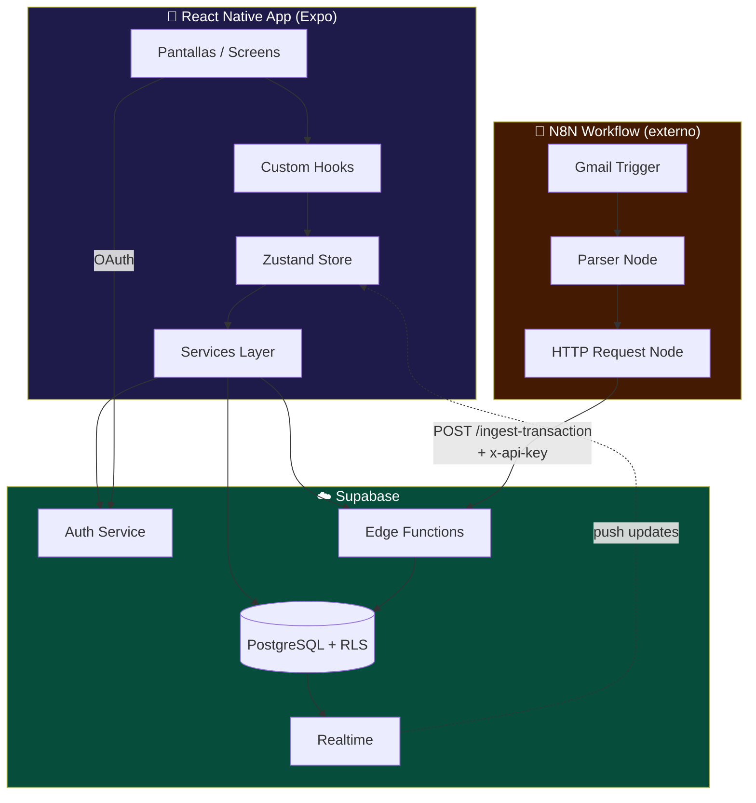
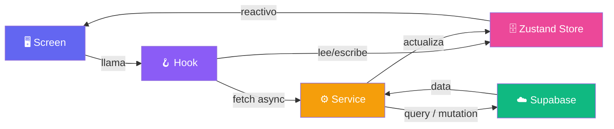
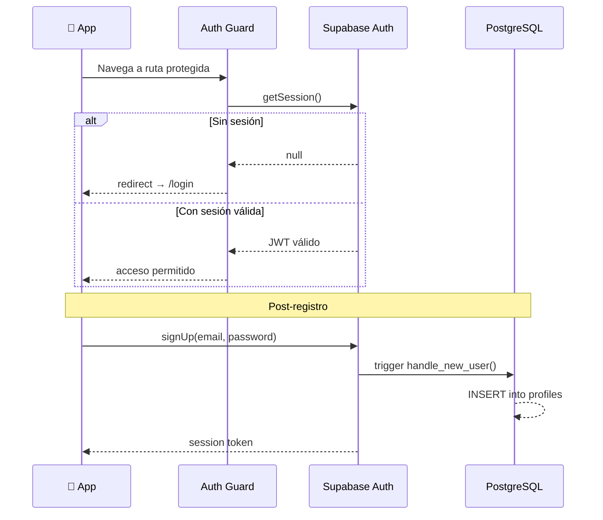
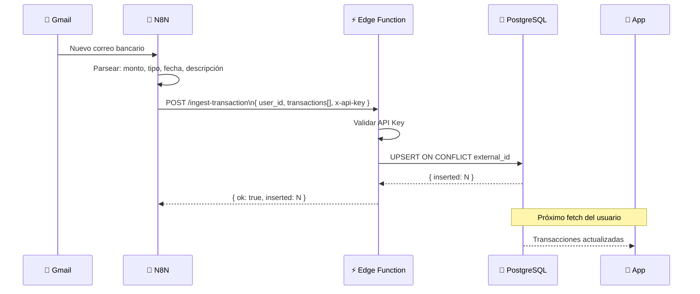
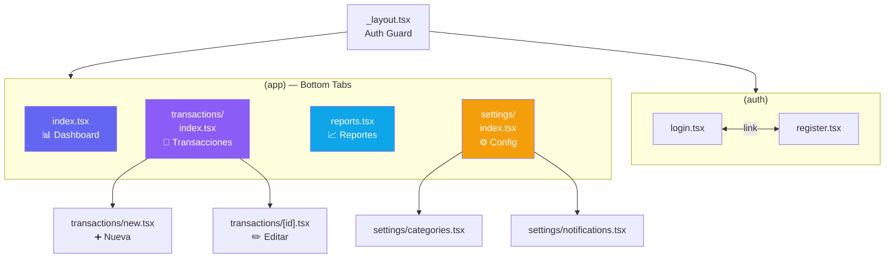

---
tags:
  - arquitectura
  - react-native
  - supabase
  - n8n
  - expo
created: '2026-03-01'
status: ready
---
# 🏗️ Arquitectura del Sistema

Tags: #arquitectura #react-native #supabase #n8n #expo

---

## Stack Tecnológico

| Capa           | Tecnología                     | Justificación                            |
| -------------- | ------------------------------ | ---------------------------------------- |
| Mobile         | React Native + Expo            | Desarrollo rápido multiplataforma        |
| Routing        | Expo Router (file-based)       | Navegación declarativa tipo Next.js      |
| Estado global  | Zustand                        | Ligero, sin boilerplate                  |
| Backend / Auth | Supabase                       | Auth + DB + Edge Functions en uno        |
| Base de datos  | PostgreSQL (Supabase)          | Relacional, RLS nativo                   |
| Gráficas       | Victory Native / Gifted Charts | Compatibles con RN                       |
| Notificaciones | Expo Notifications             | Integrado con Expo                       |
| Automatización | N8N                            | Orquesta Gmail → Supabase invisiblemente |

---

## Diagrama de Arquitectura General



---

## Flujo de Datos (Patrón por capas)



---

## Flujo de Autenticación



---

## Flujo de Sincronización N8N



---

## Estructura de Carpetas

```
finance-app/
├── app/                          # Expo Router (file-based routing)
│   ├── (auth)/
│   │   ├── login.tsx
│   │   └── register.tsx
│   ├── (app)/                    # Rutas protegidas
│   │   ├── _layout.tsx           # Tab navigator
│   │   ├── index.tsx             # Dashboard / Home
│   │   ├── transactions/
│   │   │   ├── index.tsx         # Lista de transacciones
│   │   │   ├── [id].tsx          # Detalle / editar
│   │   │   └── new.tsx           # Nueva transacción
│   │   ├── reports.tsx           # Gráficas y reportes
│   │   └── settings/
│   │       ├── index.tsx         # Perfil
│   │       ├── categories.tsx    # Gestión de categorías
│   │       └── notifications.tsx # Config notificaciones
│   └── _layout.tsx               # Root layout + auth guard
│
├── src/
│   ├── components/
│   │   ├── ui/                   # Componentes base reutilizables
│   │   │   ├── Button.tsx
│   │   │   ├── Card.tsx
│   │   │   ├── Input.tsx
│   │   │   ├── Badge.tsx
│   │   │   ├── LoadingSkeleton.tsx
│   │   │   ├── EmptyState.tsx
│   │   │   ├── Toast.tsx
│   │   │   └── ConfirmModal.tsx
│   │   ├── dashboard/
│   │   │   ├── SummaryCard.tsx   # Balance total
│   │   │   ├── FinanceRow.tsx    # Fila por categoría
│   │   │   └── QuickStats.tsx
│   │   ├── transactions/
│   │   │   ├── TransactionItem.tsx
│   │   │   ├── TransactionForm.tsx
│   │   │   └── FilterBar.tsx
│   │   └── charts/
│   │       ├── DonutChart.tsx
│   │       └── BarChart.tsx
│   │
│   ├── store/
│   │   ├── authStore.ts
│   │   ├── transactionStore.ts
│   │   └── categoryStore.ts
│   │
│   ├── services/
│   │   ├── supabase.ts           # Cliente Supabase
│   │   ├── authService.ts
│   │   ├── transactionService.ts
│   │   ├── categoryService.ts
│   │   └── dashboardService.ts
│   │
│   ├── hooks/
│   │   ├── useAuth.ts
│   │   ├── useDashboard.ts
│   │   ├── useTransactions.ts
│   │   ├── useReports.ts
│   │   └── useNotifications.ts
│   │
│   ├── types/
│   │   ├── database.ts           # Tipos generados por Supabase CLI
│   │   └── app.ts                # Tipos propios de la app
│   │
│   ├── utils/
│   │   ├── formatCurrency.ts
│   │   ├── formatDate.ts
│   │   └── calculateBalance.ts
│   │
│   └── constants/
│       ├── categories.ts         # Categorías predefinidas
│       ├── colors.ts
│       └── theme.ts
│
├── supabase/
│   └── functions/
│       └── ingest-transaction/
│           └── index.ts          # Edge Function para N8N
│
└── assets/
    ├── fonts/
    └── images/
```

---

## Mapa de pantallas y navegación



---

## Contrato del Endpoint N8N

```
POST https://<project>.supabase.co/functions/v1/ingest-transaction

Headers:
  x-api-key: <INGEST_API_KEY>
  Content-Type: application/json

Body:
{
  "user_id": "uuid-del-usuario",
  "transactions": [
    {
      "gmail_message_id": "18c4f2a...",
      "amount": 450.00,
      "type": "expense",
      "description": "Starbucks Reforma",
      "date": "2026-03-01",
      "category_id": null
    }
  ]
}

Response 200:
{ "ok": true, "inserted": 1 }

Response 401: Unauthorized
Response 400: Bad Request
Response 500: { "error": "..." }
```

---

## Links relacionados

- [[Base de Datos]] — Esquema SQL completo y ERD
- [[Casos de Uso]] — Diagramas de flujo por feature
- [[Roadmap]] — Timeline de desarrollo
- [[Checklist MVP]] — Tasks por módulo

---

*[[README|← Volver al índice]]*
