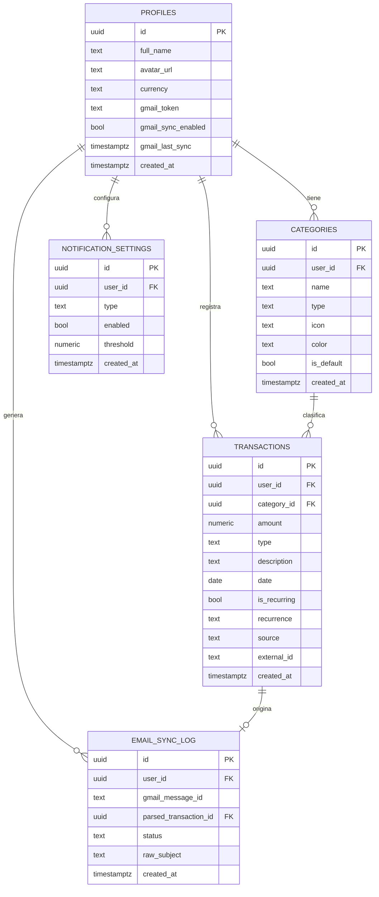
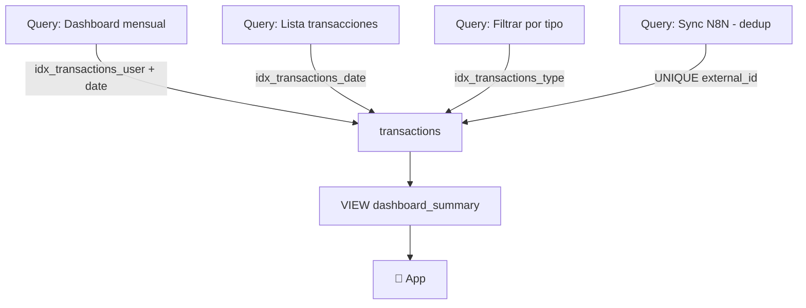

---
tags:
  - database
  - supabase
  - postgresql
  - sql
  - rls
created: '2026-03-01'
status: ready
---
# 🗄️ Base de Datos

Tags: #database #supabase #postgresql #sql

---

## Diagrama de Entidades (ERD)



---

## Schema SQL completo

### Profiles

```sql
-- Extiende auth.users de Supabase
create table profiles (
  id            uuid references auth.users on delete cascade primary key,
  full_name     text,
  avatar_url    text,
  currency      text default 'MXN',
  -- Gmail sync (manejado por N8N, invisible al usuario)
  gmail_token        text,
  gmail_sync_enabled boolean default false,
  gmail_last_sync    timestamptz,
  created_at    timestamptz default now()
);

-- Trigger: crear profile automáticamente al registrarse
create or replace function handle_new_user()
returns trigger as $$
begin
  insert into public.profiles (id, full_name)
  values (new.id, new.raw_user_meta_data->>'full_name');
  return new;
end;
$$ language plpgsql security definer;

create trigger on_auth_user_created
  after insert on auth.users
  for each row execute procedure handle_new_user();
```

### Categories

```sql
create table categories (
  id          uuid default gen_random_uuid() primary key,
  user_id     uuid references profiles(id) on delete cascade,
  name        text not null,
  type        text not null check (type in (
                'income','expense','saving','investment','debt'
              )),
  icon        text,     -- nombre del ícono ej: 'home', 'car', 'food'
  color       text,     -- hex: '#6366f1'
  is_default  boolean default false,
  created_at  timestamptz default now()
);

-- Índice para queries frecuentes
create index idx_categories_user on categories(user_id);
create index idx_categories_type  on categories(type);
```

### Transactions

```sql
create table transactions (
  id           uuid default gen_random_uuid() primary key,
  user_id      uuid references profiles(id) on delete cascade,
  category_id  uuid references categories(id) on delete set null,
  amount       numeric(12,2) not null,
  type         text not null check (type in (
                 'income','expense','saving','investment','debt'
               )),
  description  text,
  date         date not null default current_date,
  is_recurring boolean default false,
  recurrence   text check (recurrence in ('daily','weekly','monthly','yearly')),
  -- Integración N8N
  source       text default 'manual',  -- 'manual' | 'n8n_gmail'
  external_id  text unique,            -- gmail_message_id para evitar duplicados
  created_at   timestamptz default now()
);

-- Índices
create index idx_transactions_user    on transactions(user_id);
create index idx_transactions_date    on transactions(date desc);
create index idx_transactions_type    on transactions(type);
create index idx_transactions_source  on transactions(source);
```

### Notification Settings

```sql
create table notification_settings (
  id         uuid default gen_random_uuid() primary key,
  user_id    uuid references profiles(id) on delete cascade,
  type       text not null check (type in (
               'weekly_reminder','expense_alert','transaction_confirm'
             )),
  enabled    boolean default true,
  threshold  numeric(5,2),  -- % para expense_alert, ej: 80.00
  created_at timestamptz default now(),
  unique(user_id, type)
);
```

### Email Sync Log

```sql
create table email_sync_log (
  id                    uuid default gen_random_uuid() primary key,
  user_id               uuid references profiles(id) on delete cascade,
  gmail_message_id      text unique,
  parsed_transaction_id uuid references transactions(id) on delete set null,
  status                text check (status in ('success','failed','skipped')),
  raw_subject           text,
  created_at            timestamptz default now()
);
```

---

## Row Level Security (RLS)

```sql
-- Habilitar RLS en todas las tablas
alter table profiles            enable row level security;
alter table categories          enable row level security;
alter table transactions        enable row level security;
alter table notification_settings enable row level security;
alter table email_sync_log      enable row level security;

-- Policies: cada usuario solo ve sus propios datos
create policy "own profile"
  on profiles for all using (auth.uid() = id);

create policy "own categories"
  on categories for all using (auth.uid() = user_id);

create policy "own transactions"
  on transactions for all using (auth.uid() = user_id);

create policy "own notifications"
  on notification_settings for all using (auth.uid() = user_id);

create policy "own sync log"
  on email_sync_log for all using (auth.uid() = user_id);
```

---

## Vista: Dashboard Summary

```sql
create or replace view dashboard_summary as
select
  user_id,
  date_trunc('month', date)::date                                   as month,
  coalesce(sum(amount) filter (where type = 'income'),     0)       as total_income,
  coalesce(sum(amount) filter (where type = 'expense'),    0)       as total_expense,
  coalesce(sum(amount) filter (where type = 'saving'),     0)       as total_saving,
  coalesce(sum(amount) filter (where type = 'investment'), 0)       as total_investment,
  coalesce(sum(amount) filter (where type = 'debt'),       0)       as total_debt,
  -- Balance neto
  coalesce(sum(amount) filter (where type = 'income'),     0)
  - coalesce(sum(amount) filter (where type = 'expense'),  0)
  - coalesce(sum(amount) filter (where type = 'debt'),     0)
  + coalesce(sum(amount) filter (where type = 'saving'),   0)
  + coalesce(sum(amount) filter (where type = 'investment'),0)      as net_balance
from transactions
group by user_id, date_trunc('month', date);
```

---

## Categorías predefinidas (seed)

```sql
insert into categories (user_id, name, type, icon, color, is_default) values
-- Ingresos
(null, 'Salario',       'income',     'briefcase', '#10b981', true),
(null, 'Freelance',     'income',     'laptop',    '#34d399', true),
(null, 'Inversiones',   'income',     'trending-up','#6ee7b7',true),
-- Gastos
(null, 'Comida',        'expense',    'utensils',  '#f59e0b', true),
(null, 'Transporte',    'expense',    'car',       '#fbbf24', true),
(null, 'Renta',         'expense',    'home',      '#f97316', true),
(null, 'Entretenimiento','expense',   'tv',        '#fb923c', true),
(null, 'Salud',         'expense',    'heart',     '#ef4444', true),
-- Ahorro / Inversión / Deuda
(null, 'Fondo emergency','saving',    'shield',    '#6366f1', true),
(null, 'Vacaciones',    'saving',     'plane',     '#8b5cf6', true),
(null, 'Bolsa/ETFs',    'investment', 'bar-chart', '#0ea5e9', true),
(null, 'Tarjeta crédito','debt',      'credit-card','#ec4899',true);
```

---

## Flujo de Indexes y Performance



---

*[[README|← Volver al índice]] | [[Arquitectura|Arquitectura →]]*
