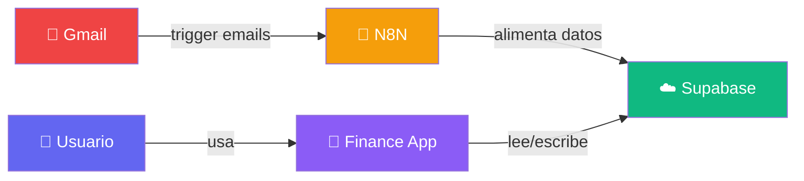
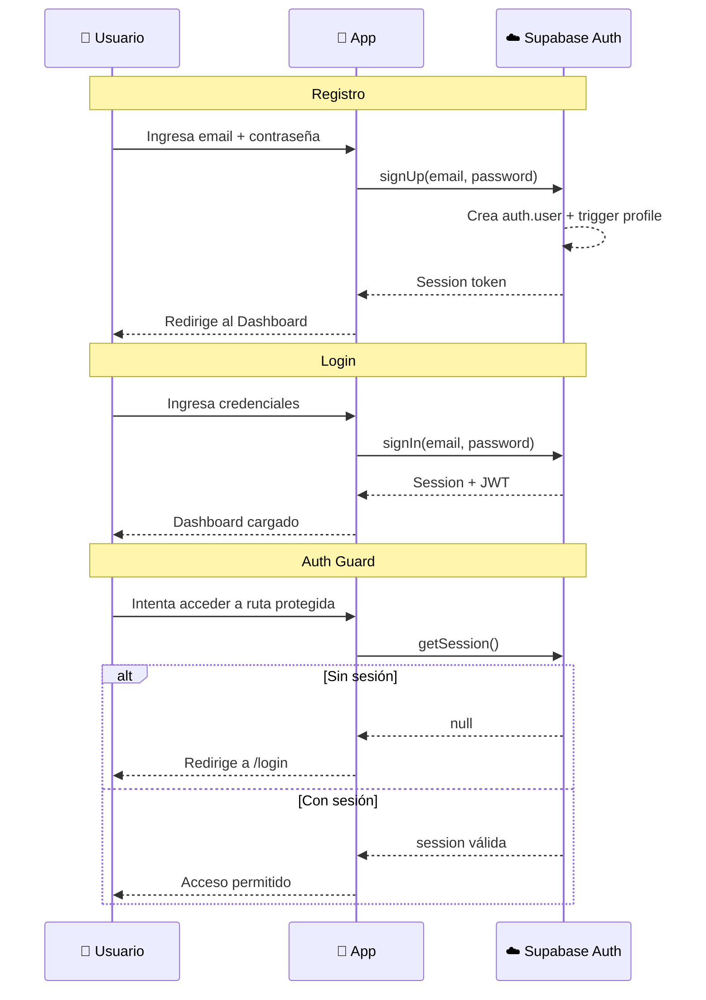
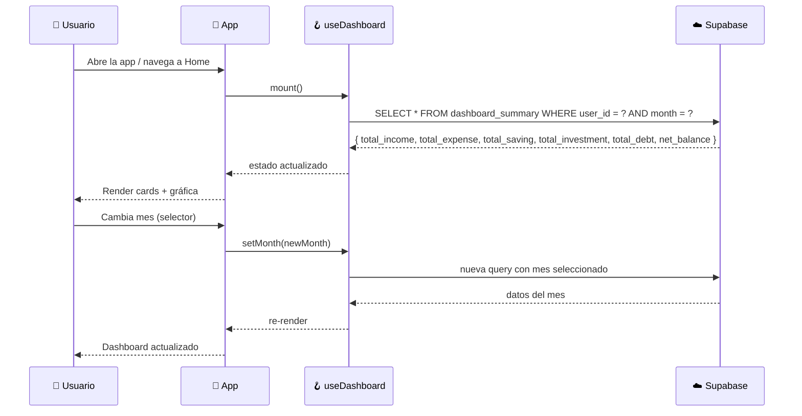
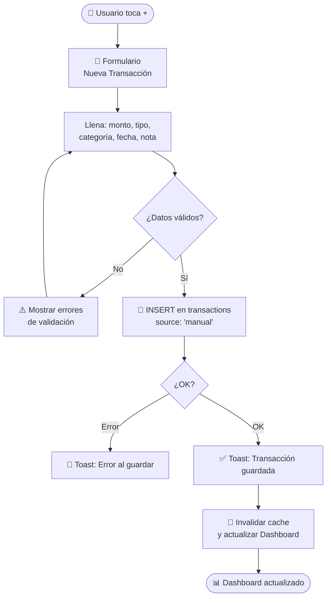
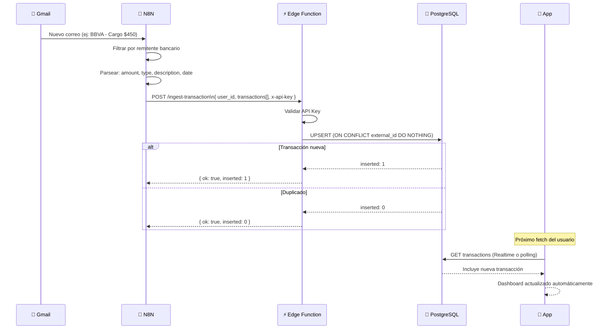
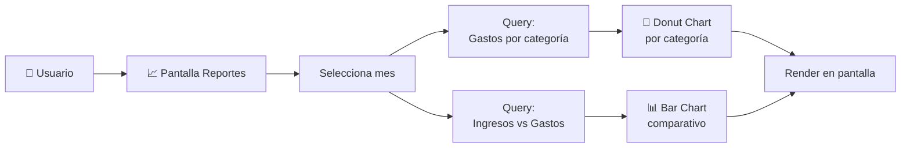
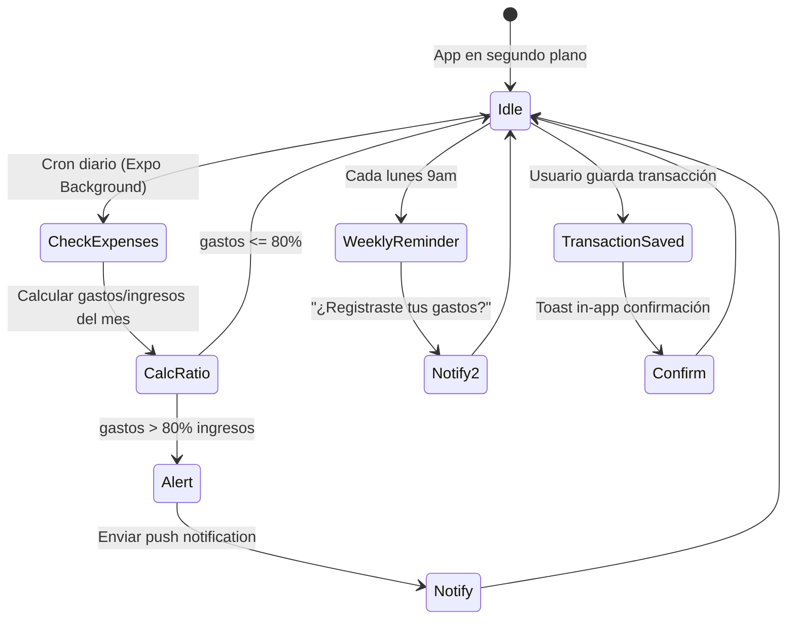

---
tags:
  - casos-de-uso
  - uml
  - flujos
  - diagramas
created: '2026-03-01'
status: ready
---
# 🎭 Casos de Uso

Tags: #casos-de-uso #uml #flujos #usuario

---

## Actores del sistema

---

## Diagrama de Casos de Uso General

```mermaid
graph TD
    Actor["👤 Usuario"]

    subgraph Auth["🔐 Autenticación"]
        UC1["Registrarse"]
        UC2["Iniciar sesión"]
        UC3["Cerrar sesión"]
    end

    subgraph Dashboard["📊 Dashboard"]
        UC4["Ver resumen financiero"]
        UC5["Ver balance total"]
        UC6["Ver gráficas del mes"]
    end

    subgraph Transacciones["💸 Transacciones"]
        UC7["Agregar transacción manual"]
        UC8["Editar transacción"]
        UC9["Eliminar transacción"]
        UC10["Filtrar transacciones"]
        UC11["Ver detalle de transacción"]
    end

    subgraph Reportes["📈 Reportes"]
        UC12["Ver reporte mensual"]
        UC13["Comparar meses"]
        UC14["Ver distribución por categoría"]
    end

    subgraph Config["⚙️ Configuración"]
        UC15["Gestionar categorías"]
        UC16["Crear categoría custom"]
        UC17["Configurar notificaciones"]
        UC18["Editar perfil"]
    end

    Actor --> UC1
    Actor --> UC2
    Actor --> UC3
    Actor --> UC4
    Actor --> UC7
    Actor --> UC8
    Actor --> UC9
    Actor --> UC10
    Actor --> UC12
    Actor --> UC15
    Actor --> UC16
    Actor --> UC17
    Actor --> UC18

    UC4 --> UC5
    UC4 --> UC6
    UC12 --> UC13
    UC12 --> UC14
```

---

## Casos de Uso: Autenticación

---

## Casos de Uso: Dashboard

---

## Casos de Uso: Agregar Transacción Manual

---

## Casos de Uso: Sincronización N8N (automática)

---

## Casos de Uso: Reportes

---

## Casos de Uso: Notificaciones

---

## Matriz de Casos de Uso vs Pantallas

| Caso de Uso | Pantalla | Prioridad |
|---|---|---|
| Registrarse / Login | `/auth/login`, `/auth/register` | 🔴 Alta |
| Ver Dashboard | `/` (Home) | 🔴 Alta |
| Agregar transacción | `/transactions/new` | 🔴 Alta |
| Ver lista transacciones | `/transactions` | 🔴 Alta |
| Editar / Eliminar transacción | `/transactions/[id]` | 🟡 Media |
| Ver reportes | `/reports` | 🟡 Media |
| Gestionar categorías | `/settings/categories` | 🟡 Media |
| Configurar notificaciones | `/settings/notifications` | 🟢 Baja |
| Editar perfil | `/settings` | 🟢 Baja |

---

*[[README|← Volver al índice]] | [[Roadmap|Roadmap →]]*
