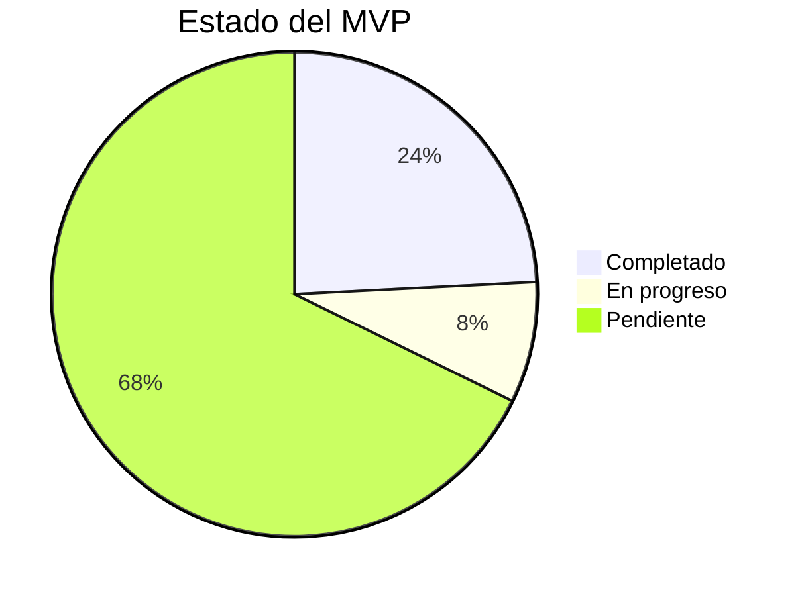

---
tags:
  - checklist
  - mvp
  - tasks
  - progress
created: '2026-03-01'
status: in-progress
---
# ✅ Checklist MVP

Tags: #checklist #mvp #tasks #progress

---

## Progreso general

---

## 🟦 Fase 1 — Setup y Base

### Proyecto

- [ ] Inicializar Expo con TypeScript: `npx create-expo-app finance-app --template`
- [ ] Configurar path aliases en `tsconfig.json`
- [ ] Instalar dependencias base
  - [ ] `expo-router`
  - [ ] `zustand`
  - [ ] `@supabase/supabase-js`
  - [ ] `react-native-mmkv`
  - [ ] `expo-notifications`
  - [ ] `victory-native` o `react-native-gifted-charts`
- [ ] Configurar variables de entorno (`.env` + `app.config.ts`)
- [ ] Setup de ESLint + Prettier

### Supabase

- [ ] Crear proyecto en Supabase
- [ ] Ejecutar SQL: tabla `profiles`
- [ ] Ejecutar SQL: tabla `categories`
- [ ] Ejecutar SQL: tabla `transactions`
- [ ] Ejecutar SQL: tabla `notification_settings`
- [ ] Ejecutar SQL: tabla `email_sync_log`
- [ ] Configurar RLS en todas las tablas
- [ ] Crear `dashboard_summary` view
- [ ] Crear trigger `handle_new_user`
- [ ] Ejecutar seed de categorías predefinidas
- [ ] Generar types de TypeScript desde Supabase CLI

### Arquitectura base

- [ ] Crear `src/services/supabase.ts` (cliente)
- [ ] Crear `src/types/database.ts`
- [ ] Crear `src/types/app.ts`
- [ ] Crear `src/constants/categories.ts`
- [ ] Crear `src/constants/colors.ts`
- [ ] Crear `src/constants/theme.ts`

---

## 🔐 Autenticación

- [ ] Pantalla `(auth)/login.tsx`
- [ ] Pantalla `(auth)/register.tsx`
- [ ] `src/services/authService.ts`
  - [ ] `signUp(email, password)`
  - [ ] `signIn(email, password)`
  - [ ] `signOut()`
  - [ ] `getSession()`
- [ ] `src/store/authStore.ts`
- [ ] `src/hooks/useAuth.ts`
- [ ] Auth guard en `app/_layout.tsx`
- [ ] Redirect automático post-login al Dashboard
- [ ] Redirect automático post-logout a Login

---

## 📊 Dashboard

- [ ] Pantalla `(app)/index.tsx`
- [ ] `src/services/dashboardService.ts`
  - [ ] `getSummary(userId, month)`
- [ ] `src/hooks/useDashboard.ts`
- [ ] Componente `SummaryCard.tsx` (balance total + indicador +/-)
- [ ] Componente `FinanceRow.tsx` (cada categoría: icono + label + monto)
- [ ] Componente `QuickStats.tsx` (mini resumen rápido)
- [ ] Selector de mes en el header
- [ ] Loading skeleton mientras carga
- [ ] Empty state si no hay transacciones
- [ ] Pull-to-refresh

---

## 💸 Transacciones

### Lista

- [ ] Pantalla `(app)/transactions/index.tsx`
- [ ] `src/services/transactionService.ts`
  - [ ] `getAll(userId, filters)`
  - [ ] `getById(id)`
  - [ ] `create(transaction)`
  - [ ] `update(id, data)`
  - [ ] `delete(id)`
- [ ] `src/store/transactionStore.ts`
- [ ] `src/hooks/useTransactions.ts`
- [ ] Componente `TransactionItem.tsx`
- [ ] Componente `FilterBar.tsx`
  - [ ] Filtro por tipo
  - [ ] Filtro por mes
  - [ ] Filtro por categoría
- [ ] Paginación o infinite scroll
- [ ] FAB (Floating Action Button) para nueva transacción

### Nueva / Editar

- [ ] Pantalla `(app)/transactions/new.tsx`
- [ ] Pantalla `(app)/transactions/[id].tsx`
- [ ] Componente `TransactionForm.tsx`
  - [ ] Campo monto (teclado numérico)
  - [ ] Selector tipo (income/expense/saving/investment/debt)
  - [ ] Selector categoría (filtrado por tipo)
  - [ ] Date picker
  - [ ] Campo descripción (opcional)
  - [ ] Toggle recurrente
- [ ] Validación de formulario
- [ ] Confirmación antes de eliminar

---

## 📈 Reportes

- [ ] Pantalla `(app)/reports.tsx`
- [ ] `src/hooks/useReports.ts`
- [ ] Componente `DonutChart.tsx` (gastos por categoría)
- [ ] Componente `BarChart.tsx` (ingresos vs gastos por mes)
- [ ] Selector de mes
- [ ] Tabla resumen de categorías con montos y %
- [ ] Comparativa vs mes anterior

---

## ⚙️ Configuración

- [ ] Pantalla `(app)/settings/index.tsx`
- [ ] Pantalla `(app)/settings/categories.tsx`
  - [ ] Listar categorías del usuario
  - [ ] Crear categoría custom
  - [ ] Editar categoría
  - [ ] Eliminar categoría (solo custom)
- [ ] Pantalla `(app)/settings/notifications.tsx`
  - [ ] Toggle recordatorio semanal
  - [ ] Toggle alerta de gastos
  - [ ] Slider para threshold de alerta (%)
- [ ] `src/services/categoryService.ts`
- [ ] `src/store/categoryStore.ts`

---

## 🔔 Notificaciones

- [ ] `src/hooks/useNotifications.ts`
- [ ] Solicitar permisos al onboarding
- [ ] Notificación semanal (lunes 9am)
- [ ] Alerta: gastos > umbral % de ingresos
- [ ] Toast in-app al guardar transacción
- [ ] Configuración guardada en `notification_settings`

---

## ⚡ Edge Function (N8N Integration)

- [ ] Crear `supabase/functions/ingest-transaction/index.ts`
- [ ] Validación de `x-api-key` header
- [ ] Validación del payload
- [ ] UPSERT con `ON CONFLICT external_id`
- [ ] Respuesta estructurada `{ ok, inserted }`
- [ ] Configurar `INGEST_API_KEY` como secret en Supabase
- [ ] Deploy con `supabase functions deploy ingest-transaction`
- [ ] Test con curl / Postman
- [ ] Test con N8N workflow real

---

## 🎨 UI / UX Components base

- [ ] `Button.tsx` (variants: primary, secondary, ghost, danger)
- [ ] `Card.tsx`
- [ ] `Input.tsx` (con label + error state)
- [ ] `Badge.tsx` (para tipos de transacción)
- [ ] `LoadingSkeleton.tsx`
- [ ] `EmptyState.tsx`
- [ ] `Toast.tsx` (éxito / error)
- [ ] `ConfirmModal.tsx` (para eliminar)

---

## 🚀 Deploy

- [ ] Instalar EAS CLI: `npm install -g eas-cli`
- [ ] Configurar `eas.json`
- [ ] Build de desarrollo: `eas build --profile development`
- [ ] Build de producción: `eas build --profile production`
- [ ] Subir a TestFlight (iOS) o APK interno (Android)

---

## 🧪 QA final

- [ ] Flujo completo: registro → dashboard → nueva tx → reporte
- [ ] Probar sincronización N8N end-to-end
- [ ] Verificar deduplicación de transacciones
- [ ] Probar en iOS y Android
- [ ] Verificar RLS (no se filtran datos entre usuarios)
- [ ] Performance: tiempo de carga del dashboard < 1.5s
- [ ] Error handling en todos los servicios

---

## 📊 Métricas de completitud por módulo

| Módulo | Tareas | Completadas | % |
|---|---|---|---|
| Setup | 14 | 0 | 0% |
| Auth | 10 | 0 | 0% |
| Dashboard | 10 | 0 | 0% |
| Transacciones | 18 | 0 | 0% |
| Reportes | 6 | 0 | 0% |
| Configuración | 10 | 0 | 0% |
| Notificaciones | 6 | 0 | 0% |
| Edge Function | 9 | 0 | 0% |
| UI Components | 8 | 0 | 0% |
| Deploy + QA | 11 | 0 | 0% |
| **Total** | **102** | **0** | **0%** |

---

*[[README|← Volver al índice]] | [[Roadmap|← Roadmap]]*
