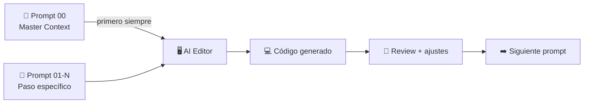

---
tags:
  - prompts
  - ai-editor
  - cursor
  - windsurf
created: '2026-03-01'
---
# 🤖 Prompts para AI Code Editors

Tags: #prompts #cursor #windsurf #copilot #ai-editor

> Prompts listos para usar en Cursor, Windsurf, GitHub Copilot Workspace o cualquier editor con IA. Están ordenados por fase de implementación. Úsalos en orden para construir la app paso a paso.

---

## 📋 Índice de Prompts

| # | Prompt | Fase | Descripción |
|---|---|---|---|
| 0 | [[Prompt 00 - General Master]] | — | Prompt maestro con todo el contexto del proyecto |
| 1 | [[Prompt 01 - Setup y Configuracion]] | Fase 1 | Inicializar proyecto, dependencias, estructura |
| 2 | [[Prompt 02 - Supabase y Base de Datos]] | Fase 1 | Schema SQL, RLS, tipos TypeScript |
| 3 | [[Prompt 03 - Autenticacion]] | Fase 1 | Login, registro, auth guard |
| 4 | [[Prompt 04 - Navegacion y Layout]] | Fase 1 | Expo Router, tabs, stack navigation |
| 5 | [[Prompt 05 - Dashboard]] | Fase 2 | Pantalla principal, summary cards, datos reales |
| 6 | [[Prompt 06 - Transacciones CRUD]] | Fase 2 | Lista, nueva, editar, eliminar transacción |
| 7 | [[Prompt 07 - Categorias]] | Fase 2 | Categorías predefinidas y personalizadas |
| 8 | [[Prompt 08 - Graficas y Reportes]] | Fase 3 | Donut chart, bar chart, pantalla reportes |
| 9 | [[Prompt 09 - Notificaciones]] | Fase 3 | Push notifications, alertas, recordatorios |
| 10 | [[Prompt 10 - Edge Function N8N]] | Fase 4 | Endpoint ingest-transaction para N8N |
| 11 | [[Prompt 11 - UI Polish y Componentes]] | Fase 5 | Componentes base, empty states, skeletons |
| 12 | [[Prompt 12 - QA y Deploy]] | Fase 5 | Testing, EAS Build, checklist final |

---

## 💡 Cómo usar estos prompts

**Recomendación:** Siempre incluye el Prompt 00 (Master) al inicio de cada sesión nueva en tu editor. Luego pega el prompt del paso que vayas a implementar.

---

*[[../README|← Volver al índice principal]]*
