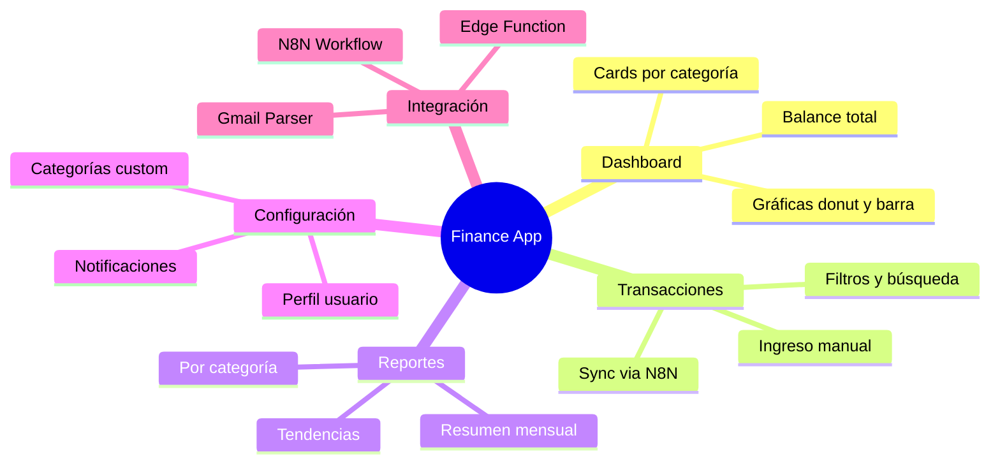
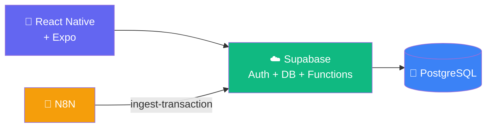

---
tags:
  - finance-app
  - mvp
  - react-native
created: '2026-03-01'
status: in-progress
---
# 💰 Finance App — Documentación General

> App personal de finanzas con dashboard minimalista, sincronización automática via Gmail → N8N → Supabase y visualización de gastos, ingresos, ahorros, inversiones y deudas.

---

## 📁 Índice de documentación

| Documento | Descripción | Estado |
|---|---|---|
| [[Arquitectura]] | Stack, carpetas y flujo de datos | ✅ |
| [[Base de Datos]] | Esquema SQL, RLS y vistas | ✅ |
| [[Casos de Uso]] | Diagrama UML de actores y flujos | ✅ |
| [[Roadmap]] | Fases de desarrollo y timeline | ✅ |
| [[Checklist MVP]] | Lista de tareas por módulo | ✅ |
| [[Prompts/README Prompts\|Prompts para AI Editor]] | Prompts listos para Cursor/Windsurf | ✅ |

---

## 🎯 Visión del producto

App **personal** de finanzas enfocada en un dashboard minimalista que muestra el estado financiero completo en un vistazo. Las transacciones pueden ingresarse manualmente o sincronizarse automáticamente desde correos bancarios via N8N.

---

## 🧩 Módulos principales

---

## 🏗️ Stack de un vistazo

---

## 📊 Métricas del MVP

| Métrica | Meta |
|---|---|
| Pantallas | 6 |
| Semanas de desarrollo | 6 |
| Bancos soportados (N8N) | 5 |
| Categorías predefinidas | 12 |

---

*Última actualización: 2026-03-01*
