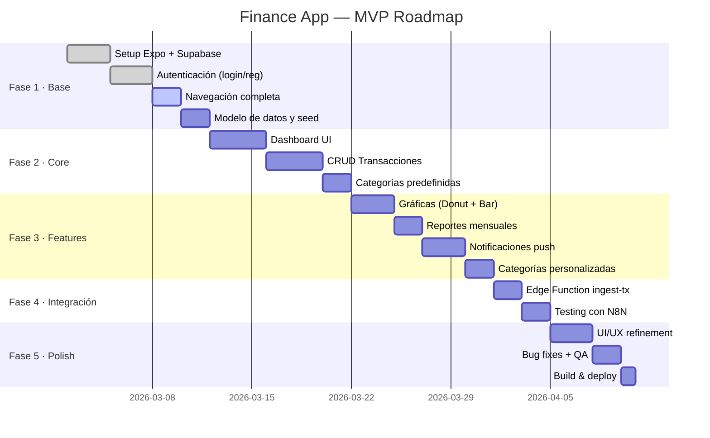
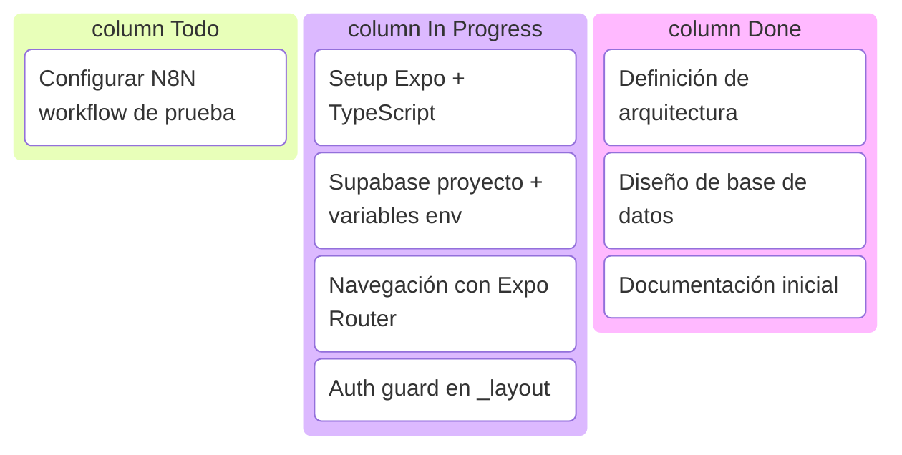
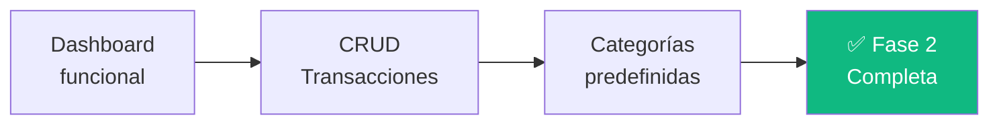
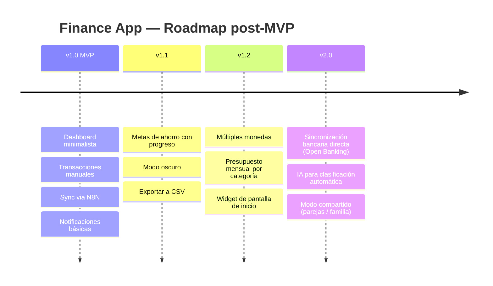
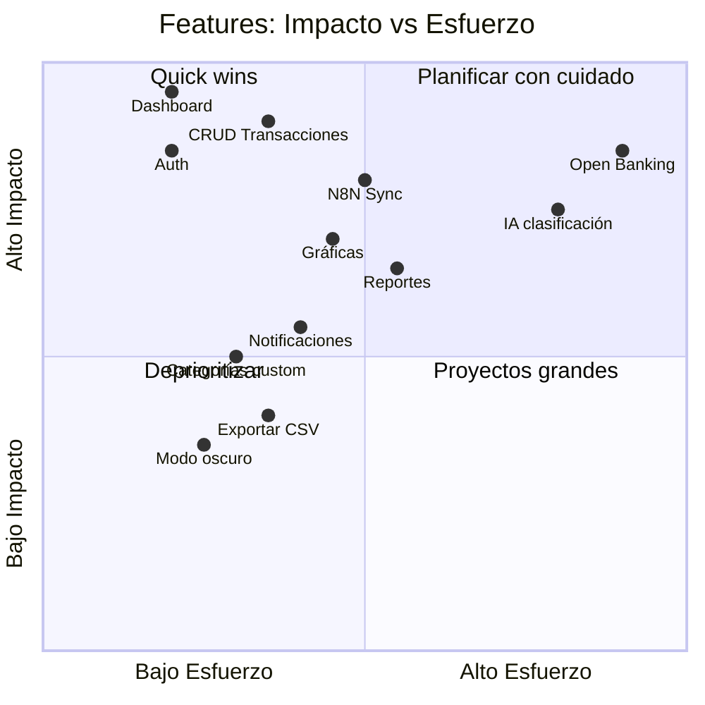

---
tags:
  - roadmap
  - planning
  - timeline
  - gantt
created: '2026-03-01'
status: ready
---
# 🗺️ Roadmap

Tags: #roadmap #planning #mvp #timeline

---

## Timeline general

---

## Fases detalladas

### 🟦 Fase 1 — Base (Semana 1-2)

**Entregables:**
- Proyecto Expo inicializado con TypeScript
- Supabase conectado con Auth funcional
- Login y registro operativos
- Navegación entre pantallas (tabs + stacks)
- Tablas creadas con RLS activo
- Seed de categorías predefinidas

---

### 🟨 Fase 2 — Core (Semana 3-4)

**Entregables:**
- Dashboard mostrando datos reales desde Supabase
- CRUD completo de transacciones
- Formulario de nueva transacción con validación
- Filtros básicos (por tipo, por mes)
- Vista de lista de transacciones

---

### 🟧 Fase 3 — Features (Semana 5)

**Entregables:**
- Gráfica de dona (distribución por categoría)
- Gráfica de barras (ingresos vs gastos por mes)
- Pantalla de reportes con selector de mes
- Notificaciones push configuradas
- Categorías personalizables por usuario

---

### 🟥 Fase 4 — Integración N8N (Semana 6 inicio)

**Entregables:**
- Edge Function `ingest-transaction` desplegada
- API Key configurada como secret en Supabase
- Workflow de N8N conectado y testeado
- Deduplicación por `external_id` verificada
- Manejo de errores y reintentos en N8N

---

### 🟪 Fase 5 — Polish & Deploy (Semana 6 fin)

**Entregables:**
- Revisión UX: transiciones, loading states, empty states
- Bug fixing general
- Build de producción con EAS Build (Expo)
- TestFlight (iOS) o APK interno (Android)

---

## Versiones futuras (post-MVP)

---

## Prioridad de features

---

*[[README|← Volver al índice]] | [[Checklist MVP|Checklist →]]*
