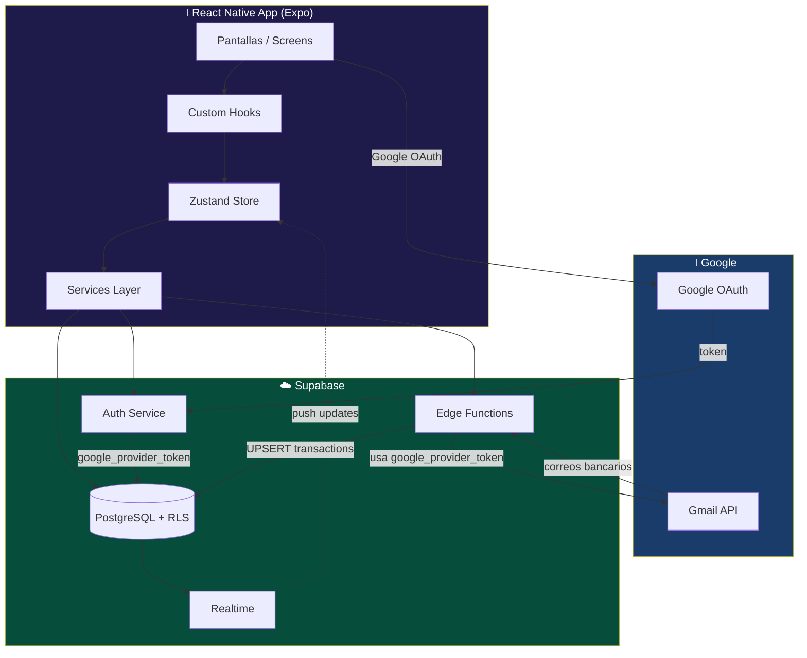
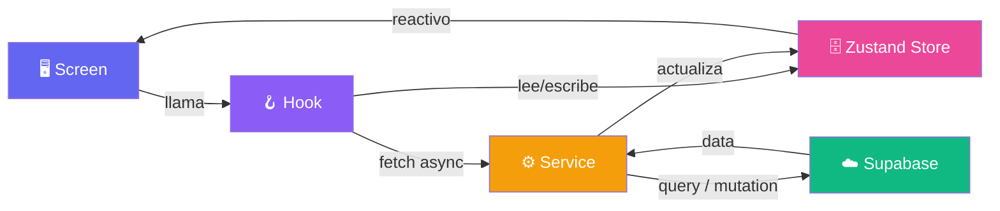
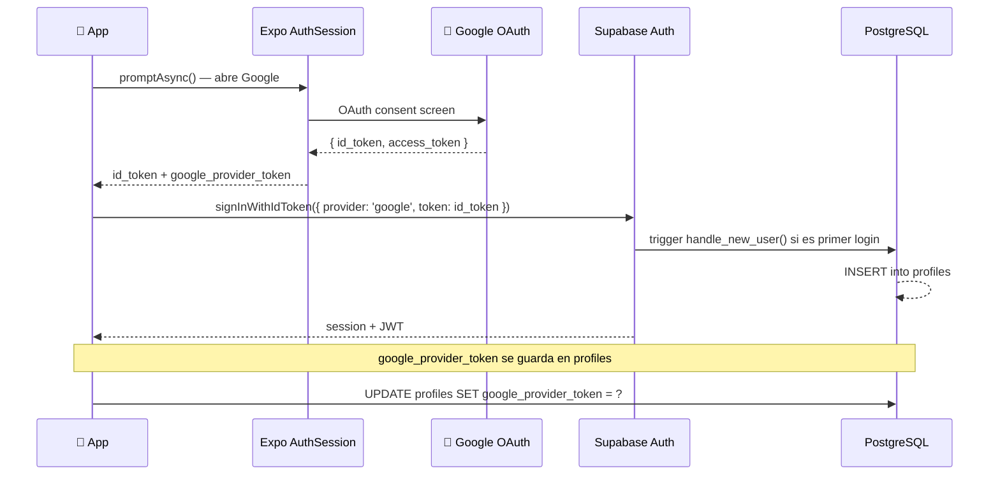
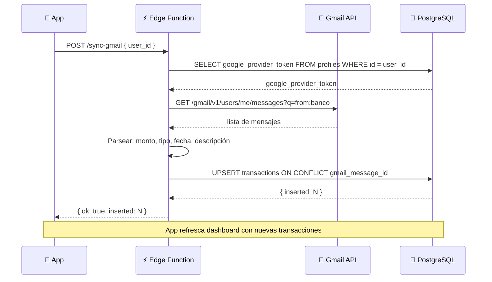
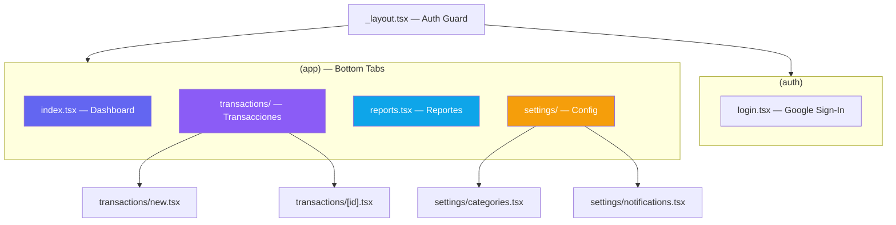
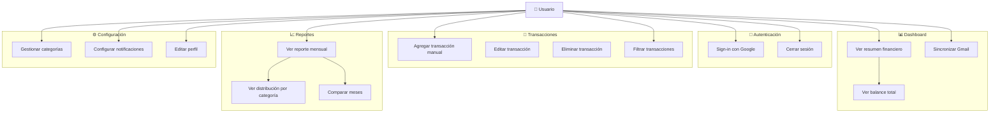

# Arquitectura — Finance App IA

## Stack Tecnológico

| Capa           | Tecnología                       | Justificación                            |
| -------------- | -------------------------------- | ---------------------------------------- |
| Mobile         | React Native + Expo              | Desarrollo rápido multiplataforma        |
| Routing        | Expo Router (file-based)         | Navegación declarativa tipo Next.js      |
| Estado global  | Zustand                          | Ligero, sin boilerplate                  |
| Backend / Auth | Supabase                         | Auth + DB + Edge Functions en uno        |
| Auth social    | Google OAuth (Supabase + Expo)   | Sign-in con Google + acceso Gmail API    |
| Base de datos  | PostgreSQL (Supabase)            | Relacional, RLS nativo                   |
| Gmail sync     | Gmail API via Edge Function      | Lee correos bancarios con token del user |
| Gráficas       | Victory Native / Gifted Charts   | Compatibles con React Native             |
| Notificaciones | Expo Notifications               | Integrado con Expo                       |

---

## Diagrama de Arquitectura General



---

## Flujo de Datos (Patrón por capas)



---

## Flujo de Autenticación con Google



---

## Flujo de Sincronización Gmail



---

## Estructura de Carpetas

```
finance-app/
├── app/                          # Expo Router (file-based routing)
│   ├── (auth)/
│   │   └── login.tsx             # Login con Google
│   ├── (app)/                    # Rutas protegidas
│   │   ├── _layout.tsx           # Tab navigator
│   │   ├── index.tsx             # Dashboard / Home
│   │   ├── transactions/
│   │   │   ├── index.tsx
│   │   │   ├── [id].tsx
│   │   │   └── new.tsx
│   │   ├── reports.tsx
│   │   └── settings/
│   │       ├── index.tsx
│   │       ├── categories.tsx
│   │       └── notifications.tsx
│   └── _layout.tsx               # Root layout + auth guard
│
├── src/
│   ├── components/
│   │   ├── ui/                   # Button, Card, Input, Badge, Toast, etc.
│   │   ├── dashboard/            # SummaryCard, FinanceRow, QuickStats
│   │   ├── transactions/         # TransactionItem, TransactionForm, FilterBar
│   │   └── charts/               # DonutChart, BarChart
│   ├── store/
│   │   ├── authStore.ts
│   │   ├── transactionStore.ts
│   │   └── categoryStore.ts
│   ├── services/
│   │   ├── supabase.ts           # Cliente Supabase
│   │   ├── authService.ts        # Google OAuth + Supabase auth
│   │   ├── transactionService.ts
│   │   ├── categoryService.ts
│   │   └── dashboardService.ts
│   ├── hooks/
│   │   ├── useAuth.ts
│   │   ├── useDashboard.ts
│   │   ├── useTransactions.ts
│   │   ├── useReports.ts
│   │   └── useNotifications.ts
│   ├── types/
│   │   ├── database.ts           # Tipos generados por Supabase CLI
│   │   └── app.ts
│   └── constants/
│       ├── categories.ts
│       ├── colors.ts
│       └── theme.ts
│
├── supabase/
│   └── functions/
│       └── sync-gmail/
│           └── index.ts          # Edge Function: Gmail API → transactions
│
└── assets/
```

---

## Mapa de Pantallas y Navegación



---

## Actores y Casos de Uso



### Prioridad de pantallas

| Pantalla | Ruta | Prioridad |
|---|---|---|
| Login Google | `/auth/login` | Alta |
| Dashboard | `/` | Alta |
| Nueva transacción | `/transactions/new` | Alta |
| Lista transacciones | `/transactions` | Alta |
| Editar transacción | `/transactions/[id]` | Media |
| Reportes | `/reports` | Media |
| Categorías | `/settings/categories` | Media |
| Notificaciones | `/settings/notifications` | Baja |
| Perfil | `/settings` | Baja |

---

## Contrato del Edge Function: sync-gmail

```
POST https://<project>.supabase.co/functions/v1/sync-gmail

Headers:
  Authorization: Bearer <supabase_jwt>
  Content-Type: application/json

Body:
{
  "user_id": "uuid-del-usuario"
}

Response 200:
{ "ok": true, "inserted": 3, "skipped": 1 }

Response 401: Unauthorized (token inválido o expirado)
Response 400: { "error": "user_id requerido" }
Response 500: { "error": "..." }
```

La Edge Function:
1. Lee `google_provider_token` desde `profiles`
2. Llama Gmail API con filtros bancarios (`from:notificaciones@bbva.com`, etc.)
3. Parsea asunto/cuerpo con regex o IA
4. Hace UPSERT en `transactions` con `ON CONFLICT (gmail_message_id)`
