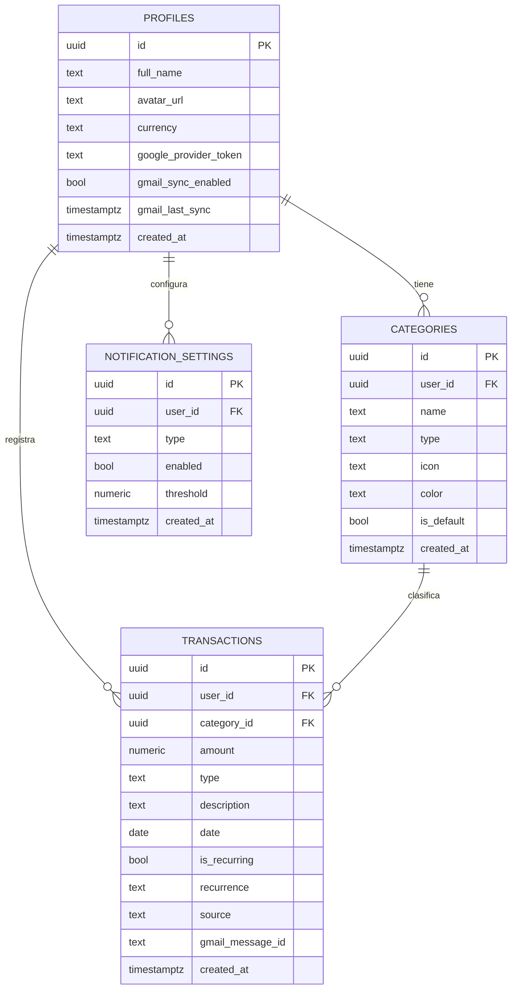

# Base de Datos — Finance App IA

## Diagrama de Entidades (ERD)



---

## Schema SQL

### Profiles

```sql
create table profiles (
  id                    uuid references auth.users on delete cascade primary key,
  full_name             text,
  avatar_url            text,
  currency              text default 'MXN',
  -- Google / Gmail sync
  google_provider_token text,
  gmail_sync_enabled    boolean default false,
  gmail_last_sync       timestamptz,
  created_at            timestamptz default now()
);

-- Trigger: crear profile automáticamente al registrarse con Google
create or replace function handle_new_user()
returns trigger as $$
begin
  insert into public.profiles (id, full_name, avatar_url)
  values (
    new.id,
    new.raw_user_meta_data->>'full_name',
    new.raw_user_meta_data->>'avatar_url'
  );
  return new;
end;
$$ language plpgsql security definer;

create trigger on_auth_user_created
  after insert on auth.users
  for each row execute procedure handle_new_user();
```

### Categories

```sql
create table categories (
  id          uuid default gen_random_uuid() primary key,
  user_id     uuid references profiles(id) on delete cascade,
  name        text not null,
  type        text not null check (type in ('income','expense','saving','investment','debt')),
  icon        text,
  color       text,
  is_default  boolean default false,
  created_at  timestamptz default now()
);

create index idx_categories_user on categories(user_id);
create index idx_categories_type on categories(type);
```

### Transactions

```sql
create table transactions (
  id               uuid default gen_random_uuid() primary key,
  user_id          uuid references profiles(id) on delete cascade,
  category_id      uuid references categories(id) on delete set null,
  amount           numeric(12,2) not null,
  type             text not null check (type in ('income','expense','saving','investment','debt')),
  description      text,
  date             date not null default current_date,
  is_recurring     boolean default false,
  recurrence       text check (recurrence in ('daily','weekly','monthly','yearly')),
  -- Fuente y deduplicación Gmail
  source           text default 'manual',   -- 'manual' | 'gmail'
  gmail_message_id text unique,             -- evita duplicados en sync
  created_at       timestamptz default now()
);

create index idx_transactions_user   on transactions(user_id);
create index idx_transactions_date   on transactions(date desc);
create index idx_transactions_type   on transactions(type);
create index idx_transactions_source on transactions(source);
```

### Notification Settings

```sql
create table notification_settings (
  id         uuid default gen_random_uuid() primary key,
  user_id    uuid references profiles(id) on delete cascade,
  type       text not null check (type in ('weekly_reminder','expense_alert','transaction_confirm')),
  enabled    boolean default true,
  threshold  numeric(5,2),  -- % para expense_alert (ej: 80.00)
  created_at timestamptz default now(),
  unique(user_id, type)
);
```

---

## Row Level Security (RLS)

```sql
alter table profiles              enable row level security;
alter table categories            enable row level security;
alter table transactions          enable row level security;
alter table notification_settings enable row level security;

create policy "own profile"       on profiles              for all using (auth.uid() = id);
create policy "own categories"    on categories            for all using (auth.uid() = user_id);
create policy "own transactions"  on transactions          for all using (auth.uid() = user_id);
create policy "own notifications" on notification_settings for all using (auth.uid() = user_id);
```

---

## Vista: Dashboard Summary

```sql
create or replace view dashboard_summary as
select
  user_id,
  date_trunc('month', date)::date                                    as month,
  coalesce(sum(amount) filter (where type = 'income'),      0)       as total_income,
  coalesce(sum(amount) filter (where type = 'expense'),     0)       as total_expense,
  coalesce(sum(amount) filter (where type = 'saving'),      0)       as total_saving,
  coalesce(sum(amount) filter (where type = 'investment'),  0)       as total_investment,
  coalesce(sum(amount) filter (where type = 'debt'),        0)       as total_debt,
  coalesce(sum(amount) filter (where type = 'income'),      0)
  - coalesce(sum(amount) filter (where type = 'expense'),   0)
  - coalesce(sum(amount) filter (where type = 'debt'),      0)
  + coalesce(sum(amount) filter (where type = 'saving'),    0)
  + coalesce(sum(amount) filter (where type = 'investment'),0)       as net_balance
from transactions
group by user_id, date_trunc('month', date);
```

---

## Seed: Categorías Predefinidas

```sql
insert into categories (user_id, name, type, icon, color, is_default) values
-- Ingresos
(null, 'Salario',        'income',     'briefcase',  '#10b981', true),
(null, 'Freelance',      'income',     'laptop',     '#34d399', true),
(null, 'Inversiones',    'income',     'trending-up','#6ee7b7', true),
-- Gastos
(null, 'Comida',         'expense',    'utensils',   '#f59e0b', true),
(null, 'Transporte',     'expense',    'car',        '#fbbf24', true),
(null, 'Renta',          'expense',    'home',       '#f97316', true),
(null, 'Entretenimiento','expense',    'tv',         '#fb923c', true),
(null, 'Salud',          'expense',    'heart',      '#ef4444', true),
-- Ahorro / Inversión / Deuda
(null, 'Fondo emergency','saving',     'shield',     '#6366f1', true),
(null, 'Vacaciones',     'saving',     'plane',      '#8b5cf6', true),
(null, 'Bolsa/ETFs',     'investment', 'bar-chart',  '#0ea5e9', true),
(null, 'Tarjeta crédito','debt',       'credit-card','#ec4899', true);
```
