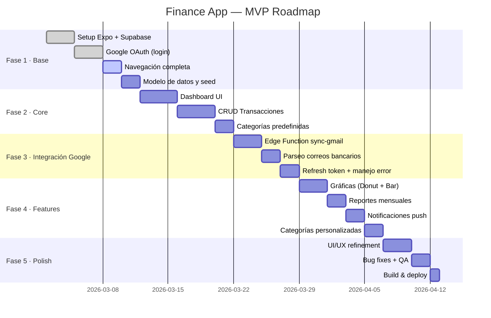
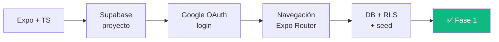
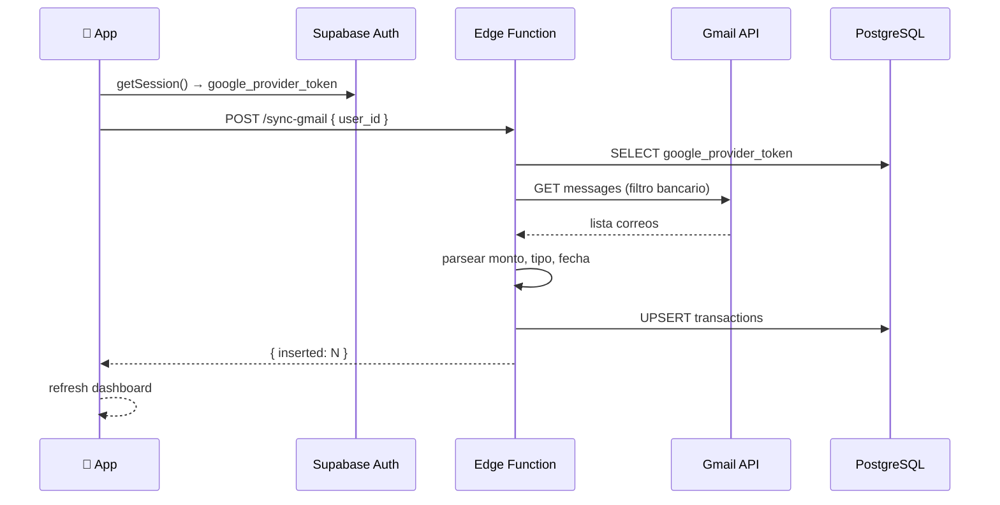
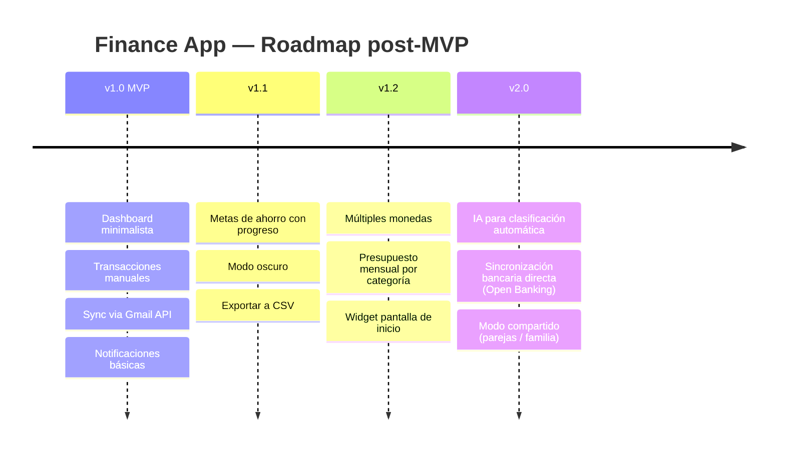
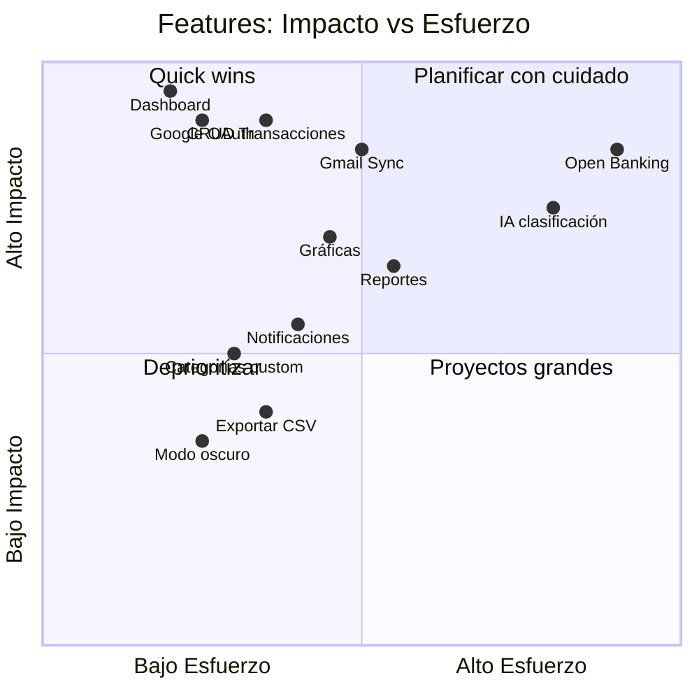

# Roadmap MVP — Finance App IA

## Timeline General

---

## Fases Detalladas

### Fase 1 — Base (Semana 1-2)

**Entregables:**
- Proyecto Expo inicializado con TypeScript
- Google OAuth funcional (Supabase Auth + `expo-auth-session`)
- Login y acceso a la app operativos
- Navegación entre pantallas (tabs + stacks)
- Tablas creadas con RLS activo
- Seed de categorías predefinidas

---

### Fase 2 — Core (Semana 3-4)

**Entregables:**
- Dashboard mostrando datos reales desde Supabase
- CRUD completo de transacciones
- Formulario de nueva transacción con validación
- Filtros básicos (por tipo, por mes, por categoría)
- Vista de lista de transacciones con paginación

---

### Fase 3 — Integración Google / Gmail (Semana 5)

**Entregables:**
- Edge Function `sync-gmail` desplegada en Supabase
- `google_provider_token` guardado y refrescado desde la app
- Parseo de correos bancarios (BBVA, Citibanamex, HSBC, Santander, Banorte)
- UPSERT con `ON CONFLICT (gmail_message_id)` para evitar duplicados
- Botón "Sincronizar Gmail" en la app con feedback visual
- Manejo de token expirado (re-autenticación silenciosa)

**Bancos a soportar (parseo regex):**

| Banco | Remitente | Patrón |
|---|---|---|
| BBVA | notificaciones@bbva.com | `Cargo por \$[\d,]+` |
| Citibanamex | alertas@citibanamex.com | `Compra por \$[\d,]+` |
| HSBC | alertas@hsbc.com.mx | `Cargo: \$[\d,]+` |
| Santander | alertas@santander.com.mx | `Movimiento: -\$[\d,]+` |
| Banorte | notificaciones@banorte.com | `Retiro \$[\d,]+` |

---

### Fase 4 — Features (Semana 6)

**Entregables:**
- Gráfica de dona (distribución por categoría)
- Gráfica de barras (ingresos vs gastos por mes)
- Pantalla de reportes con selector de mes y comparativa
- Notificaciones push (semanal + alerta de gastos > umbral)
- Categorías personalizables por usuario

---

### Fase 5 — Polish & Deploy (Semana 7)

**Entregables:**
- Revisión UX: transiciones, loading states, empty states
- Bug fixing general
- Build de producción con EAS Build
- TestFlight (iOS) / APK interno (Android)

---

## Versiones Futuras (post-MVP)

---

## Prioridad de Features (Impacto vs Esfuerzo)

